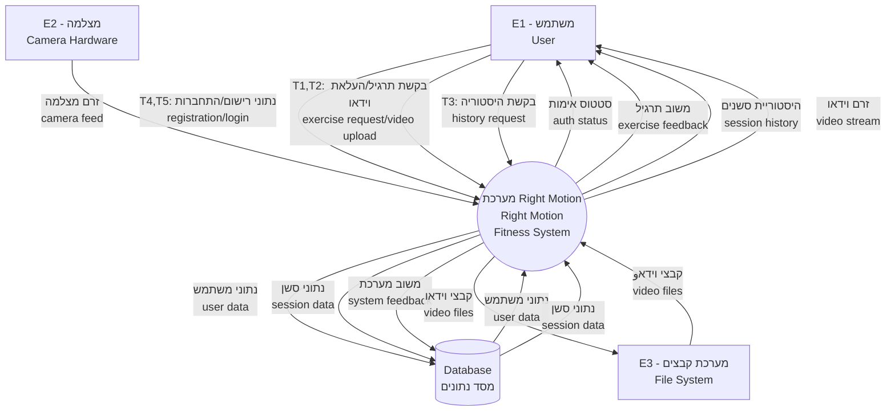

# Right Motion Fitness System - Data Flow Diagrams (Mermaid Format)

## DFD Level 0 - Context Diagram (תרשים הקשר)


---

## DFD Level 1 - System Overview (סקירת מערכת)
```mermaid
graph TD
    %% External Entities
    User[E1 - משתמש<br/>User]
    Camera[E2 - מצלמה<br/>Camera]
    FileSystem[E3 - מערכת קבצים<br/>File System]
    
    %% Main Processes - Circles
    P1((P1<br/>ניהול משתמשים<br/>User Management))
    P2((P2<br/>סשן תרגיל<br/>Exercise Session))
    P3((P3<br/>ניתוח וידאו<br/>Video Analysis))
    P4((P4<br/>תצוגת היסטוריה<br/>History Display))
    P5((P5<br/>זרם וידאו<br/>Video Streaming))
    
    %% Data Stores - Open rectangles
    DS1[|DS1<br/>מאגר משתמשים<br/>User Store|]
    DS2[|DS2<br/>מאגר תרגילים<br/>Exercise Store|]
    DS3[|DS3<br/>מאגר סשנים<br/>Session Store|]
    DS4[|DS4<br/>מאגר פרטי סשן<br/>Session Details Store|]
    DS5[|DS5<br/>מאגר משוב מערכת<br/>System Feedback Store|]
    DS6[|DS6<br/>מאגר וידאו<br/>Video Store|]
    
    %% Data Flows from User
    User -->|T4,T5: נתוני רישום/התחברות<br/>registration/login data| P1
    User -->|T1: התחלת אימון<br/>start workout| P2
    User -->|T2: העלאת וידאו<br/>video upload| P3
    User -->|T3: בקשת היסטוריה<br/>history request| P4
    
    %% Process P1 interactions
    P1 <-->|נתוני משתמש<br/>user data| DS1
    P1 -->|סטטוס אימות<br/>auth status| P2
    
    %% Process P2 interactions
    P2 <-->|נתוני תרגיל<br/>exercise data| DS2
    P2 -->|נתוני סשן<br/>session data| DS3
    P2 -->|פרטי סשן<br/>session details| DS4
    P2 -->|משוב מערכת<br/>system feedback| DS5
    P2 -->|וידאו מעובד<br/>processed video| DS6
    Camera -->|זרם מצלמה<br/>camera feed| P2
    
    %% Process P3 interactions
    P3 <-->|כללי תרגיל<br/>exercise rules| DS2
    P3 -->|נתוני סשן<br/>session data| DS3
    P3 <-->|קבצי וידאו<br/>video files| DS6
    
    %% Process P4 interactions
    P4 <-->|נתוני סשן<br/>session data| DS3
    P4 <-->|פרטי סשן<br/>session details| DS4
    P4 <-->|קבצי וידאו<br/>video files| DS6
    P4 -->|היסטוריה מעוצבת<br/>formatted history| User
    
    %% Process P5 interactions
    P5 <-->|קבצי וידאו<br/>video files| DS6
    P5 -->|זרם וידאו<br/>video stream| User
    P4 -->|בקשת זרם וידאו<br/>video stream request| P5
    
    %% File System interactions
    DS6 <-->|קבצי וידאו<br/>video files| FileSystem
```

---

## DFD Level 2 - Exercise Session Process (P2) - תהליך סשן תרגיל
```mermaid
graph TD
    %% External inputs
    User[E1 - משתמש<br/>User]
    Camera[E2 - מצלמה<br/>Camera]
    
    %% Sub-processes
    P21(P2.1<br/>אתחול סשן<br/>Session Init)
    P22(P2.2<br/>זיהוי תנוחה<br/>Pose Detection)
    P23((P2.3<br/>ניתוח צורה<br/>Form Analysis))
    P24(P2.4<br/>ספירת חזרות<br/>Rep Counting)
    P25(P2.5<br/>אחסון סשן<br/>Session Storage)
    P26(P2.6<br/>הקלטת וידאו<br/>Video Recording)
    
    %% Timer for form analysis
    T6△[T6<br/>זיהוי תנוחה שגויה<br/>Incorrect Pose Timer]
    T7△[T7<br/>סיום סשן<br/>Session End Timer]
    
    %% Data Stores
    DS2[|DS2<br/>מאגר תרגילים<br/>Exercise Store|]
    DS3[|DS3<br/>מאגר סשנים<br/>Session Store|]
    DS4[|DS4<br/>מאגר פרטי סשן<br/>Session Details Store|]
    DS6[|DS6<br/>מאגר וידאו<br/>Video Store|]
    
    %% Data Flows
    User -->|T1: התחלת סשן<br/>start session| P21
    P21 <-->|מזהה תרגיל<br/>exercise_id| DS2
    P21 -->|הגדרות סשן<br/>session config| P22
    
    Camera -->|זרם מצלמה<br/>camera feed| P22
    P22 -->|נקודות ציון תנוחה<br/>pose landmarks| P23
    
    P23 -->|חישובי זוויות<br/>angle calculations| P24
    P23 -->|T6: משוב שגיאות<br/>error feedback| T6
    T6 -->|משוב מיידי<br/>immediate feedback| User
    
    P24 <-->|נתוני סשן<br/>session data| DS3
    P24 -->|ספירת חזרות<br/>rep count| P25
    
    P25 -->|T7: סיום סשן<br/>session end| T7
    T7 -->|פרטי סשן<br/>session details| DS4
    
    P26 -->|קובץ וידאו<br/>video file| DS6
    P22 -->|זרם וידאו<br/>video stream| P26
```

---

## DFD Level 2 - Video Analysis Process (P3) - תהליך ניתוח וידאו
```mermaid
graph TD
    %% External inputs
    User[E1 - משתמש<br/>User]
    FileSystem[E3 - מערכת קבצים<br/>File System]
    
    %% Sub-processes
    P31(P3.1<br/>העלאת וידאו<br/>Video Upload)
    P32(P3.2<br/>עיבוד פריים אחר פריים<br/>Frame-by-Frame Processing)
    P33(P3.3<br/>יצירת משוב מתוזמן<br/>Timestamped Feedback Generation)
    P34(P3.4<br/>אחסון וידאו מעובד<br/>Processed Video Storage)
    
    %% Data Stores
    DS2[|DS2<br/>מאגר תרגילים<br/>Exercise Store|]
    DS3[|DS3<br/>מאגר סשנים<br/>Session Store|]
    DS6[|DS6<br/>מאגר וידאו<br/>Video Store|]
    
    %% Data Flows
    User -->|T2: העלאת קובץ וידאו<br/>video file upload| P31
    P31 <-->|כללי תרגיל<br/>exercise rules| DS2
    P31 -->|וידאו שהועלה<br/>uploaded video| P32
    
    P32 -->|נקודות ציון לפי פריים<br/>pose landmarks per frame| P33
    P33 -->|וידאו מנותח + משוב<br/>analyzed video + feedback| P34
    
    P34 <-->|וידאו מעובד<br/>processed video| DS6
    P34 -->|נתוני סשן<br/>session data| DS3
    
    DS6 <-->|קבצי וידאו<br/>video files| FileSystem
    P34 -->|וידאו מנותח<br/>analyzed video| User
```

---

## DFD Level 2 - Form Analysis Process (P2.3) - תהליך ניתוח צורה
```mermaid
graph TD
    %% Input from parent process
    PoseData[נקודות ציון תנוחה<br/>מתהליך 2.2<br/>Pose Landmarks from 2.2]
    
    %% Sub-processes
    P231(2.3.1<br/>בודק תרגיל<br/>Exercise Checker)
    P232(2.3.2<br/>מונה חזרות<br/>Rep Counter)
    P233(2.3.3<br/>מייצר משוב<br/>Feedback Generator)
    P234(2.3.4<br/>פרטי סשן<br/>Session Details)
    
    %% Data Store
    DS2[|DS2<br/>מאגר תרגילים<br/>Exercise Store|]
    
    %% Output to parent process
    OutputP24[לתהליך 2.4<br/>To Process 2.4]
    
    %% Data Flows
    PoseData -->|נקודות ציון<br/>pose landmarks| P231
    P231 <-->|כללי תרגיל<br/>exercise rules| DS2
    P231 -->|חישובי זוויות<br/>angle calculations| P232
    
    P232 -->|ספירת חזרות<br/>rep count| P233
    P233 -->|הודעות משוב<br/>feedback messages| P234
    P234 -->|פרטי סשן<br/>session details| OutputP24
```

---

## DFD Level 2 - User Management Process (P1) - תהליך ניהול משתמשים
```mermaid
graph TD
    %% External Entity
    User[E1 - משתמש<br/>User]
    
    %% Sub-processes
    P11(P1.1<br/>רישום משתמש<br/>User Registration)
    P12(P1.2<br/>כניסת משתמש<br/>User Login)
    P13(P1.3<br/>מנהל מצב סשן<br/>Session State Manager)
    
    %% Data Store
    DS1[|DS1<br/>מאגר משתמשים<br/>User Store|]
    
    %% Timers
    T4△[T4<br/>שליחת טופס רישום<br/>Registration Form Submit]
    T5△[T5<br/>שליחת נתוני התחברות<br/>Login Credentials Submit]
    
    %% Data Flows
    User -->|T4: נתוני רישום<br/>registration data| T4
    T4 -->|נתוני רישום<br/>registration data| P11
    P11 <-->|סיסמה מוצפנת, רשומת משתמש<br/>encrypted pwd, user record| DS1
    
    User -->|T5: נתוני התחברות<br/>login credentials| T5
    T5 -->|נתוני התחברות<br/>login credentials| P12
    P12 <-->|חיפוש משתמש, תוצאת אימות<br/>user lookup, auth result| DS1
    
    P12 -->|סטטוס אימות<br/>auth status| P13
    P13 -->|מצב סשן<br/>session state| User
```

---

## DFD Level 2 - History Display Process (P4) - תהליך תצוגת היסטוריה
```mermaid
graph TD
    %% External Entity
    User[E1 - משתמש<br/>User]
    
    %% Sub-processes
    P41(P4.1<br/>אחזור סשנים<br/>Session Retrieval)
    P42(P4.2<br/>העשרת פרטים<br/>Details Enrichment)
    P43(P4.3<br/>שילוב וידאו<br/>Video Integration)
    P44(P4.4<br/>תצוגת ממשק משתמש<br/>UI Display)
    
    %% Timer
    T3△[T3<br/>בקשת היסטוריה<br/>History Request]
    
    %% Data Stores
    DS3[|DS3<br/>מאגר סשנים<br/>Session Store|]
    DS4[|DS4<br/>מאגר פרטי סשן<br/>Session Details Store|]
    DS6[|DS6<br/>מאגר וידאו<br/>Video Store|]
    
    %% Data Flows
    User -->|T3: בקשת היסטוריה<br/>history request| T3
    T3 -->|מזהה משתמש<br/>user_id| P41
    P41 <-->|סשני משתמש<br/>user sessions| DS3
    
    P41 -->|רשימת סשנים<br/>session list| P42
    P42 <-->|פרטי סשן<br/>session details| DS4
    
    P42 -->|סשנים מועשרים<br/>enriched sessions| P43
    P43 <-->|קבצי וידאו<br/>video files| DS6
    
    P43 -->|היסטוריה מעוצבת<br/>formatted history| P44
    P44 -->|תצוגת היסטוריה<br/>history display| User
```

---

## DFD Level 2 - Video Streaming Process (P5) - תהליך זרם וידאו
```mermaid
graph TD
    %% External Entity
    User[E1 - משתמש<br/>User]
    UserBrowser[דפדפן משתמש<br/>נגן וידאו<br/>User Browser Video Player]
    
    %% Sub-processes
    P51(P5.1<br/>זרם וידאו בזמן אמת<br/>Real-time Video Streaming)
    P52(P5.2<br/>הגשת וידאו מעובד<br/>Processed Video Serving)
    
    %% Data Store
    DS6[|DS6<br/>מאגר וידאו<br/>Video Store|]
    
    %% Data Flows
    User -->|בקשת וידאו<br/>video request| P51
    P51 <-->|קבצי וידאו<br/>video files| DS6
    P51 -->|זרם וידאו חי<br/>live video stream| P52
    
    P52 -->|תגובת זרם וידאו<br/>video stream response| UserBrowser
    UserBrowser -->|בקשת וידאו מעובד<br/>processed video request| P52
```

---

## Data Dictionary (מילון נתונים)

### External Entities (ישויות חיצוניות)
| Entity | Hebrew Name | Description | Inputs | Outputs |
|--------|-------------|-------------|---------|---------|
| E1 | משתמש | Main system user performing exercises | registration_data, login_credentials, exercise_requests | authentication_status, exercise_feedback, session_history |
| E2 | מצלמה | Hardware camera for real-time video | - | camera_feed, video_frames |
| E3 | מערכת קבצים | File system for video storage | processed_videos | stored_video_files, video_metadata |

### Data Stores (מאגרי נתונים)
| Store | Hebrew Name | Description | Data Elements |
|-------|-------------|-------------|---------------|
| DS1 | מאגר משתמשים | User information storage (PostgreSQL) | user_id, email, username, password_hash, profile_data, user_type |
| DS2 | מאגר תרגילים | Exercise definitions and rules (PostgreSQL) | exercise_id, exercise_name, target_muscles, instructions, analysis_rules |
| DS3 | מאגר סשנים | Exercise session records (PostgreSQL) | session_id, user_id, exercise_id, timestamps, duration, video_path |
| DS4 | מאגר פרטי סשן | Detailed rep-by-rep data (PostgreSQL) | detail_id, session_id, rep_number, pose_keypoints, form_score |
| DS5 | מאגר משוב מערכת | System-generated feedback (PostgreSQL) | feedback_id, session_id, message, feedback_type, timestamp |
| DS6 | מאגר וידאו | Video file storage (File System) | video_files stored in /videos directory, referenced by video_path in DS3 |

### Processes (תהליכים)
| Process | Hebrew Name | Type | Description | Inputs | Outputs |
|---------|-------------|------|-------------|---------|---------|
| P1 | ניהול משתמשים | Complex | User registration and authentication | credentials | auth_status |
| P2 | סשן תרגיל | Complex | Live exercise session tracking | exercise_request, camera_feed | session_data |
| P3 | ניתוח וידאו | Complex | Uploaded video analysis | video_file | analyzed_video |
| P4 | תצוגת היסטוריה | Complex | Session history display | history_request | formatted_history |
| P5 | זרם וידאו | Complex | Video streaming service | video_request | video_stream |

### System Triggers (טריגרי מערכת)
| Trigger | Hebrew Name | Description | Activates | Result |
|---------|-------------|-------------|-----------|---------|
| T1 | התחלת אימון | Start workout button click | P2 Exercise Session | Real-time pose detection |
| T2 | העלאת וידאו | Video file upload | P3 Video Analysis | Frame-by-frame analysis |
| T3 | בקשת היסטוריה | History button click | P4 History Display | Session history retrieval |
| T4 | שליחת טופס רישום | Registration form submit | P1.1 User Registration | New user account |
| T5 | שליחת נתוני התחברות | Login credentials submit | P1.2 User Authentication | User session |
| T6 | זיהוי תנוחה שגויה | Incorrect pose detection | Real-time Feedback | Immediate correction |
| T7 | סיום סשן | Exercise session end | P2.5 Session Storage | Complete data save |

### Data Flows (זרימות נתונים)
| Data Flow | Hebrew Name | Description | Composition |
|-----------|-------------|-------------|-------------|
| user_credentials | נתוני התחברות | User login information | email/username, password |
| exercise_request | בקשת תרגיל | Session start request | exercise_type, user_id, options |
| pose_data | נתוני תנוחה | MediaPipe pose landmarks | x,y,z coordinates, visibility scores |
| session_data | נתוני סשן | Complete session information | timestamps, reps, duration, status |
| feedback_data | נתוני משוב | Form correction messages | messages, timestamps, rep_association |
| processed_video | וידאו מעובד | Recorded exercise session | video_file, pose_overlays, metadata |
| history_request | בקשת היסטוריה | User history query | user_id, filters, pagination |

---

## Process Complexity Legend (מקרא סוגי תהליכים)
- **○** Regular Process (תהליך רגיל) - Simple, single function
- **((○))** Complex Process (תהליך מורכב) - Multi-step process requiring decomposition
- **△** Timer/Trigger (טיימר/טריגר) - System event trigger
- **|Store|** Data Store (מאגר נתונים) - Open rectangle for data storage
- **[ ]** External Entity (ישות חיצונית) - Closed rectangle for external systems

This comprehensive DFD structure provides a complete view of the Right Motion fitness system's data architecture across all organizational levels, maintaining clarity while showing the intricate relationships between system components.